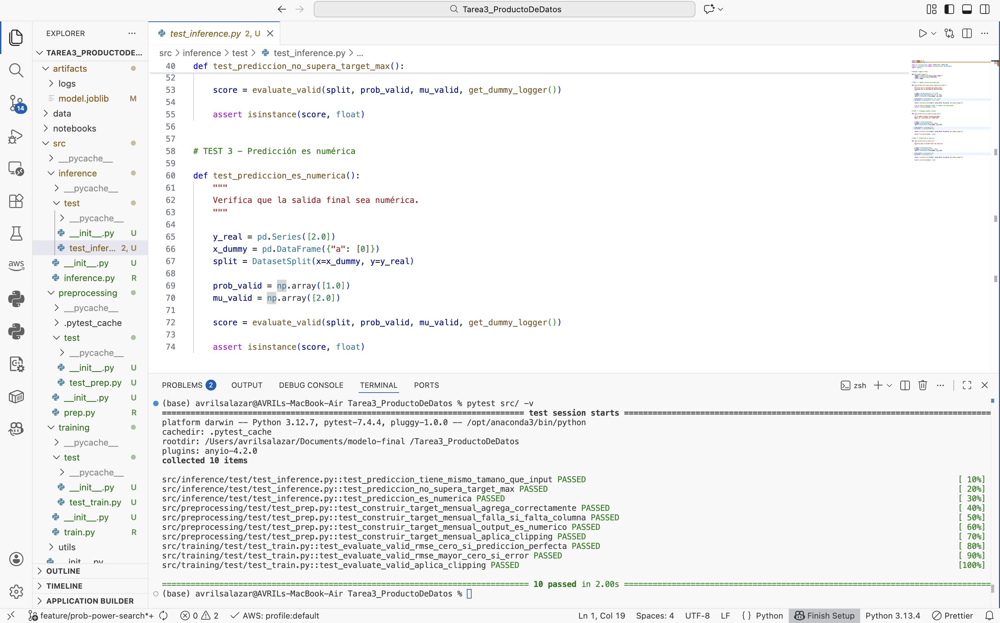

# Pronóstico de demanda mensual con LightGBM

Este repositorio implementa un pipeline para pronosticar la **demanda mensual** por combinación **producto–tienda** usando el dataset de 1C Company (Kaggle: *Predict Future Sales*). El objetivo es apoyar decisiones de inventario: **cuánto pedir y dónde colocarlo con anticipación**, buscando reducir sobrestock y disminuir ventas perdidas, además de automatizar un proceso que podría depender de promedios móviles y ajustes manuales.

El modelo principal es un enfoque en **dos etapas**: primero estima si habrá venta con una clasificación y después estima cuántas unidades se venderán con una regresión. Esto es especialmente útil cuando la demanda es **esporádica e intermitente**.

## Resultados
- El desempeño agregado cumple la meta operativa: **RMSE cercano a 1**, lo cual está por debajo del umbral de 5 unidades.
- Aun así, el análisis por segmentos muestra que el modelo puede **subestimar picos de demanda**. En producción conviene complementar con criterio de negocio y/o otros criterios, tales como inventario de seguridad para productos prioritarios.


---


## Mejora del Caso de Uso

En esta iteración se aplicó una **calibración de probabilidad** sobre el modelo de dos etapas.

Originalmente la predicción final se calculaba como:

y_hat = probabilidad * unidades_predichas

Se detectó que la probabilidad del clasificador estaba ligeramente descalibrada, por lo que se aplicó un ajuste exponencial:

y_hat = (probabilidad ^ alpha) * unidades_predichas

Se realizó una búsqueda simple en validación y se fijó:

alpha = 0.90

**Impacto en métricas (validación interna)**

- RMSE antes: **0.882492**
- RMSE después: **0.880418**
- Mejora absoluta: **-0.002074**

La mejora resulta consistente, sin modificar arquitectura ni hiperparámetros principales.


---


## Estructura del repositorio

```text
.
├── artifacts
│   ├── logs
│   │   ├── inference_20260214_000519.log
│   │   ├── prep_20260213_235935.log
│   │   └── train_20260214_000203.log
│   └── model.joblib
├── data
│   ├── inference
│   │   └── test_features.parquet
│   ├── predictions
│   │   └── submission.csv
│   ├── prep
│   │   ├── meta.json
│   │   ├── test_features.parquet
│   │   ├── test_pairs.parquet
│   │   ├── train.parquet
│   │   └── valid.parquet
│   └── raw
│       ├── sales_train.csv
│       └── test.csv
├── docs
│   └── images
│       └── pytest.png
├── notebooks
│   ├── Entendimientodelos_datosEDA.ipynb
│   ├── FeatureEngineering.ipynb
│   ├── Modeling.ipynb
│   └── SimulationComparation.ipynb
├── src
│   ├── preprocessing
│   │   ├── prep.py
│   │   └── test
│   │       └── test_prep.py
│   ├── training
│   │   ├── train.py
│   │   └── test
│   │       └── test_train.py
│   ├── inference
│   │   ├── inference.py
│   │   └── test
│   │       └── test_inference.py
│   ├── config.py
│   └── utils
│       ├── data_validation.py
│       ├── logging_utils.py
│       └── metrics.py
├── main.py
├── pyproject.toml
├── README.md
└── uv.lock
```

Cada step del pipeline está organizado como módulo independiente,
incluyendo sus propias pruebas unitarias.


---


## Git Workflow

Se implementó una estrategia de branching profesional alineada con prácticas de MLOps.

### Ramas principales

- `main`: versión estable lista para producción
- `development`: rama de integración continua
- `feature/*`: ramas para cada entregable o mejora específica

### Flujo aplicado

1. Crear rama `feature/*` desde `development`
2. Implementar cambios de manera incremental
3. Realizar commits atómicos utilizando **Conventional Commits**
   - Ejemplo: `feat(modelo): calibración de probabilidad`
   - Ejemplo: `test(training): agrega pruebas para RMSE`
4. Abrir Pull Request hacia `development`
5. Revisar y aprobar cambios
6. Merge a `development`
7. Pull Request final de `development` hacia `main`

### Política aplicada

- No se realizaron commits directos a `main`
- No se realizaron commits directos a `development`
- Todo cambio pasó por una feature branch y un Pull Request


---


## Calidad de Código

Para verificar linting:


---


## Detalle

### Notebooks

- **`notebooks/Entendimientodelos_datosEDA.ipynb`**  
  Exploración del dataset: nulos, rangos, outliers, devoluciones, agregación mensual, estacionalidad e intermitencia (recency, meses con venta).

- **`notebooks/FeatureEngineering.ipynb`**  
  Construcción de features para series de tiempo (lags, ventanas recientes, recency, intermitencia, señales de precio y agregados laggeados) y guardado de base intermedia en `data/prep/`.

- **`notebooks/Modeling.ipynb`**  
  Entrenamiento del modelo final (clasificación + regresión), generación de predicciones y guardado de `artifacts/model.joblib` y `data/predictions/submission.csv`.

- **`notebooks/SimulationComparation.ipynb`**  
  Evaluación: calibración por deciles, análisis, comparación contra baseline y simulación operativa (sobrestock vs stockouts) con análisis de sensibilidad.


---


### Scripts (pipeline automatizable)

Los scripts se ejecutan desde la raíz del repo y siguen la estructura antes mencionada:

- **`src/prep.py`**  
  - Entrada: `data/raw/`  
  - Salida: `data/prep/` (train/valid/test_features + meta)

- **`src/train.py`**  
  - Entrada: `data/prep/`  
  - Salida: `artifacts/model.joblib`

- **`src/inference.py`**  
  - Entrada: `data/inference/` + `artifacts/model.joblib`  
  - Salida: `data/predictions/submission.csv`


---


## Métricas del modelo

- **Kaggle (Predict Future Sales)**
  - Public Score (RMSE): **1.01797**
  - Private Score (RMSE): **1.01588**
  - Leaderboard: https://www.kaggle.com/competitions/competitive-data-science-predict-future-sales/leaderboard


---


## Dependencias principales

- **pandas**
- **numpy**
- **lightgbm**
- **scikit-learn**
- **joblib**
- **pyarrow** 
- **pytest**


---
  

## Instalación y Setup

### Clonar el repositorio:
```bash
git clone <repo_url>
cd Tarea3_ProductoDeDatos
```
### Instalar dependencias con uv:
```bash
uv sync
```
### O manualmente:
```bash
pip install pandas numpy lightgbm scikit-learn joblib pyarrow
pip install pytest
```


---


## Cómo ejecutar el pipeline con uv

### Preprocesamiento y features
```text
uv run python -m src.prep
```
### Entrenamiento
```text
uv run python -m src.train
```
### Inference batch
```text
uv run python -m src.inference
```
### Outputs esperados

- data/prep/train.parquet, data/prep/valid.parquet, data/prep/test_features.parquet, data/prep/test_pairs.parquet, data/prep/meta.json

- artifacts/model.joblib

- data/predictions/submission.csv
  

  ---
## Construcción de Imágenes Docker en EC2

A continuación se muestra evidencia de la construcción de imágenes Docker dentro de una instancia EC2.

### Build — preprocessing


### Build — training and inference


---

## Ejecución de Contenedores con argumentos y logs en EC2

Los contenedores se ejecutan montando volúmenes para `data/` y `artifacts/`, y pasando argumentos por CLI.

### Run — preprocessing


### Run — training con hiperparámetros


### Run — inference


---

## Pruebas Unitarias

Se implementaron **10 pruebas unitarias** distribuidas por step del pipeline:

- 4 en preprocessing
- 3 en training
- 3 en inference

Las pruebas verifican:

- Agregación correcta de datos
- Validación de esquema
- Tipo de datos
- Manejo de outliers (clipping)
- Cálculo correcto de RMSE
- Consistencia del output

### Ejecutar pruebas

Desde la raíz del proyecto:

```bash
pytest src/ -v
```
### Resultado esperado

collected 10 items
10 passed

### Evidencia de ejecución



Estas pruebas garantizan que los componentes críticos del pipeline
funcionan correctamente antes de cualquier despliegue o integración
continua.


Referencias

Manokhin, V. (n.d.). Mastering modern time series forecasting: A comprehensive guide to statistical, machine learning, and deep learning models in Python (Early Access). Leanpub.

OpenAI. (2023). ChatGPT (Mar 14 version) [Large language model versión 5.2]. https://chat.openai.com/

