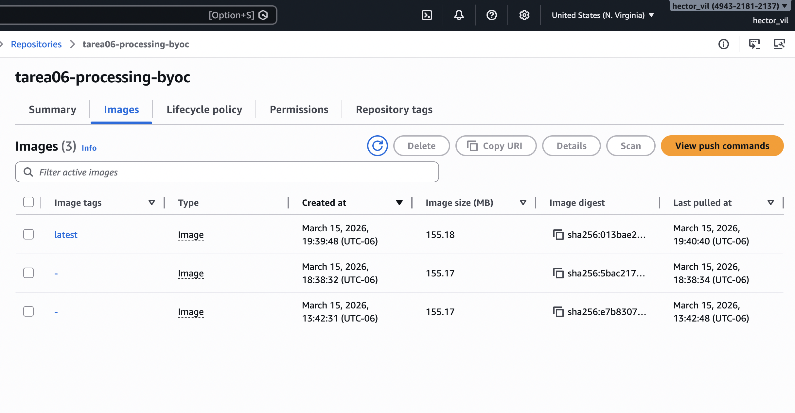
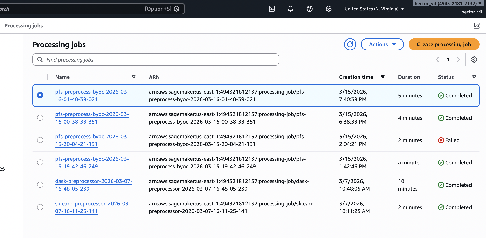
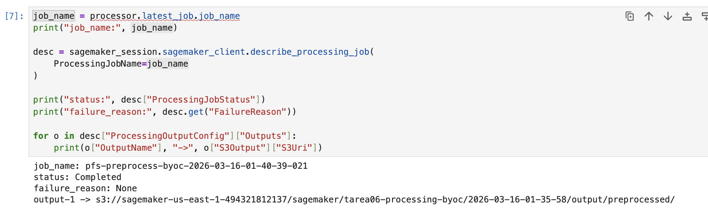
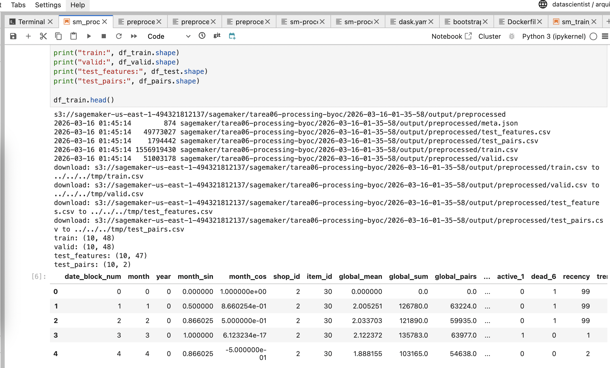

# Tarea 06 — SageMaker Processing BYOC

## Objetivo

En esta tarea se construyó un **SageMaker Processing Job** usando un **contenedor propio (BYOC)** para ejecutar el preprocesamiento de nuestros datos.

La idea fue separar el **preprocessing** del **training**. En lugar de transformar los datos en local, SageMaker toma los archivos crudos desde **S3**, ejecuta `preprocess.py` dentro del contenedor y guarda los archivos transformados nuevamente en **S3**.

---

## Flujo del procesamiento

```text
S3 (raw) -> /opt/ml/processing/input/raw -> preprocess.py -> /opt/ml/processing/output -> S3 (processed)
```

---
## Estructura agregada al repositorio
```text

processing/
├── container/
│   └── Dockerfile
└── preprocess.py

notebooks/
└── sm_processing_byoc.ipynb
```
---
## Estructura actualizada del repositorio

```text
.
├── artifacts
│   ├── logs
│   │   ├── inference_20260214_000519.log
│   │   ├── inference_20260301_122327.log
│   │   ├── prep_20260213_235935.log
│   │   ├── prep_20260301_122239.log
│   │   ├── train_20260214_000203.log
│   │   └── train_20260301_122252.log
│   └── model.joblib
├── data
│   ├── inference
│   │   └── test_features.parquet
│   ├── predictions
│   │   └── submission.csv
│   ├── prep
│   │   ├── meta.json
│   │   ├── test_features.parquet
│   │   ├── test_pairs.parquet
│   │   ├── train.parquet
│   │   └── valid.parquet
│   └── raw
│       ├── sales_train.csv
│       └── test.csv
├── docs
│   └── images
│       ├── github_pr_sagemaker_feature.png
│       ├── pytest.png
│       ├── sagemaker_ecr_repositories.png
│       ├── sagemaker_endpoint_inservice.png
│       ├── sagemaker_notebook_workflow.png
│       ├── sagemaker_realtime_inference.png
│       └── sagemaker_training_job_completed.png
├── import json.py
├── import os.jl
├── import os.py
├── main.py
├── notebooks
│   ├── Entendimientodelos_datosEDA.ipynb
│   ├── FeatureEngineering.ipynb
│   ├── Modeling.ipynb
│   ├── sagemaker_training.ipynb
│   ├── SimulationComparation.ipynb
│   └── sm_processing_byoc.ipynb
├── processing
│   ├── container
│   │   └── Dockerfile
│   └── preprocess.py
├── pyproject.toml
├── README.md
├── src
│   ├── __init__.py
│   ├── __pycache__
│   │   ├── __init__.cpython-312.pyc
│   │   └── config.cpython-312.pyc
│   ├── config.py
│   ├── inference
│   │   ├── __init__.py
│   │   ├── __main__.py
│   │   ├── __pycache__
│   │   ├── Dockerfile
│   │   ├── inference.py
│   │   └── test
│   ├── preprocessing
│   │   ├── __init__.py
│   │   ├── __main__.py
│   │   ├── __pycache__
│   │   ├── Dockerfile
│   │   ├── prep.py
│   │   └── test
│   ├── training
│   │   ├── __init__.py
│   │   ├── __main__.py
│   │   ├── __pycache__
│   │   ├── Dockerfile
│   │   ├── test
│   │   └── train.py
│   └── utils
│       ├── __init__.py
│       ├── __pycache__
│       ├── data_validation.py
│       ├── logging_utils.py
│       └── metrics.py
├── tmp
│   ├── model
│   │   └── model.joblib
│   └── output
├── tree.txt
└── uv.lock
```
## Archivos principales
### processing/container/Dockerfile:

Define la imagen Docker usada por SageMaker Processing.
Incluye las librerías necesarias para correr el preprocesamiento.

### processing/preprocess.py:

Contiene la lógica de transformación de nuestro dataset.
Lee los datos desde /opt/ml/processing/input/raw y guarda los resultados en /opt/ml/processing/output.

Los archivos generados son:

+ train.csv

+ valid.csv

+ test_features.csv

+ test_pairs.csv

### notebooks/sm_processing_byoc.ipynb:

Contiene el flujo completo de la tarea:

1.- Setup de SageMaker

2.- Carga del dataset a S3

3.- Build y push de la imagen a ECR

4.- Ejecución del Processing Job

5.- Verificación del output en S3

6.- Inspección de las primeras filas del resultado

---
## Dependencias
### Dependencias del contenedor

- scikit-learn

- pandas

- numpy

### Dependencias del notebook

- boto3

- sagemaker

---
## Qué hace el preprocessing

El script preprocess.py ajusta la lógica de preprocesamiento de nuestro proyecto para que pueda ejecutarse correctamente dentro de SageMaker Processing siguiente de forma general este flujo:

- Toma los archivos crudos del dataset

- Luego limpia y transforma los datos

- Después construye los conjuntos de entrenamiento, validación y prueba

- Y por último genera archivos CSV listos para usarse después en el pipeline
---
## Ejecución del Processing Job

El Processing Job se ejecuta con ScriptProcessor, usando una sola instancia de SageMaker.

La configuración se resume en los siguientes pasos:

- El input llegue desde S3 a /opt/ml/processing/input/raw

- luego el script corra con python3

- Donde los outputs se escriban en /opt/ml/processing/output

- Y SageMaker suba automáticamente esos resultados a S3

---
## Evidencias y screenshots de ejecuciones y de los outputs

### Imagen funcional en Amazon ECR


### Processing Job exitoso




### Output en S3



## Git Workflow

Se implementó una estrategia de branching profesional alineada con prácticas de MLOps.

### Ramas principales

- `main`: versión estable lista para producción
- `development`: rama de integración continua
- `feature/*`: ramas para cada entregable o mejora específica


## Detalle

### Notebooks

- **`notebooks/Entendimientodelos_datosEDA.ipynb`**  
  Exploración del dataset: nulos, rangos, outliers, devoluciones, agregación mensual, estacionalidad e intermitencia (recency, meses con venta).

- **`notebooks/FeatureEngineering.ipynb`**  
  Construcción de features para series de tiempo (lags, ventanas recientes, recency, intermitencia, señales de precio y agregados laggeados) y guardado de base intermedia en `data/prep/`.

- **`notebooks/Modeling.ipynb`**  
  Entrenamiento del modelo final (clasificación + regresión), generación de predicciones y guardado de `artifacts/model.joblib` y `data/predictions/submission.csv`.

- **`notebooks/SimulationComparation.ipynb`**  
  Evaluación: calibración por deciles, análisis, comparación contra baseline y simulación operativa (sobrestock vs stockouts) con análisis de sensibilidad.


---


### Scripts (pipeline automatizable)

Los scripts se ejecutan desde la raíz del repo y siguen la estructura antes mencionada:

- **`src/prep.py`**  
  - Entrada: `data/raw/`  
  - Salida: `data/prep/` (train/valid/test_features + meta)

- **`src/train.py`**  
  - Entrada: `data/prep/`  
  - Salida: `artifacts/model.joblib`

- **`src/inference.py`**  
  - Entrada: `data/inference/` + `artifacts/model.joblib`  
  - Salida: `data/predictions/submission.csv`


---


## Métricas del modelo

- **Kaggle (Predict Future Sales)**
  - Public Score (RMSE): **1.01797**
  - Private Score (RMSE): **1.01588**
  - Leaderboard: https://www.kaggle.com/competitions/competitive-data-science-predict-future-sales/leaderboard


---


## Dependencias principales

- **pandas**
- **numpy**
- **lightgbm**
- **scikit-learn**
- **joblib**
- **pyarrow** 
- **pytest**


---
  

## Instalación y Setup

### Clonar el repositorio:
```bash
git clone <repo_url>
cd Tarea3_ProductoDeDatos
```
### Instalar dependencias con uv:
```bash
uv sync
```
### O manualmente:
```bash
pip install pandas numpy lightgbm scikit-learn joblib pyarrow
pip install pytest
```


---


## Cómo ejecutar el pipeline con uv

### Preprocesamiento y features
```text
uv run python -m src.prep
```
### Entrenamiento
```text
uv run python -m src.train
```
### Inference batch
```text
uv run python -m src.inference
```
### Outputs esperados

- data/prep/train.parquet, data/prep/valid.parquet, data/prep/test_features.parquet, data/prep/test_pairs.parquet, data/prep/meta.json

- artifacts/model.joblib

- data/predictions/submission.csv
  

  ---
## Construcción de Imágenes Docker en EC2

A continuación se muestra evidencia de la construcción de imágenes Docker dentro de una instancia EC2.

### Build — preprocessing


### Build — training and inference


---

## Ejecución de Contenedores con argumentos y logs en EC2

Los contenedores se ejecutan montando volúmenes para `data/` y `artifacts/`, y pasando argumentos por CLI.

### Run — preprocessing


### Run — training con hiperparámetros


### Run — inference


---

## Pruebas Unitarias

Se implementaron **10 pruebas unitarias** distribuidas por step del pipeline:

- 4 en preprocessing
- 3 en training
- 3 en inference

Las pruebas verifican:

- Agregación correcta de datos
- Validación de esquema
- Tipo de datos
- Manejo de outliers (clipping)
- Cálculo correcto de RMSE
- Consistencia del output

### Ejecutar pruebas

Desde la raíz del proyecto:

```bash
pytest src/ -v
```
### Resultado esperado

collected 10 items
10 passed

### Evidencia de ejecución


Estas pruebas garantizan que los componentes críticos del pipeline
funcionan correctamente antes de cualquier despliegue o integración
continua.

---
### Sagemaker y contenedor BYOC


Se empaquetó el algoritmo en un contenedor BYOC compatible con SageMaker, se entrenó el modelo con un `Estimator` y se desplegó un endpoint de inferencia en tiempo real.

### Estructura del contenedor 
Se agregó el directorio `container/` para cumplir el contrato de SageMaker:

- **`train`**: wrapper de entrenamiento. Lee datos e hiperparámetros desde `/opt/ml/input/...` y guarda el modelo en `/opt/ml/model/`.
- **`serve`**: levanta el servidor de inferencia en el puerto 8080 usando Gunicorn, en lugar de ejecutar la app directamente con flask run
- **`predictor.py`**: define las rutas /ping y /invocations para verificación y predicciones.
- **`Dockerfile`**: construye la imagen BYOC para training/serving.
- **`build_and_push.sh`**: construye la imagen y la sube a Amazon ECR.

### Evidencia: imagen publicada en Amazon ECR
La imagen `predict-future-sales-byoc:latest` fue construida y subida correctamente a Amazon ECR.


### Evidencia: endpoint real-time + predicciones
Se desplegó un endpoint de SageMaker y se verificó su estado **InService**. Luego se realizaron inferencias en tiempo real y se obtuvo una respuesta con `predictions`.


Manokhin, V. (n.d.). Mastering modern time series forecasting: A comprehensive guide to statistical, machine learning, and deep learning models in Python (Early Access). Leanpub.

OpenAI. (2023). ChatGPT (Mar 14 version) [Large language model versión 5.2]. https://chat.openai.com/
..

