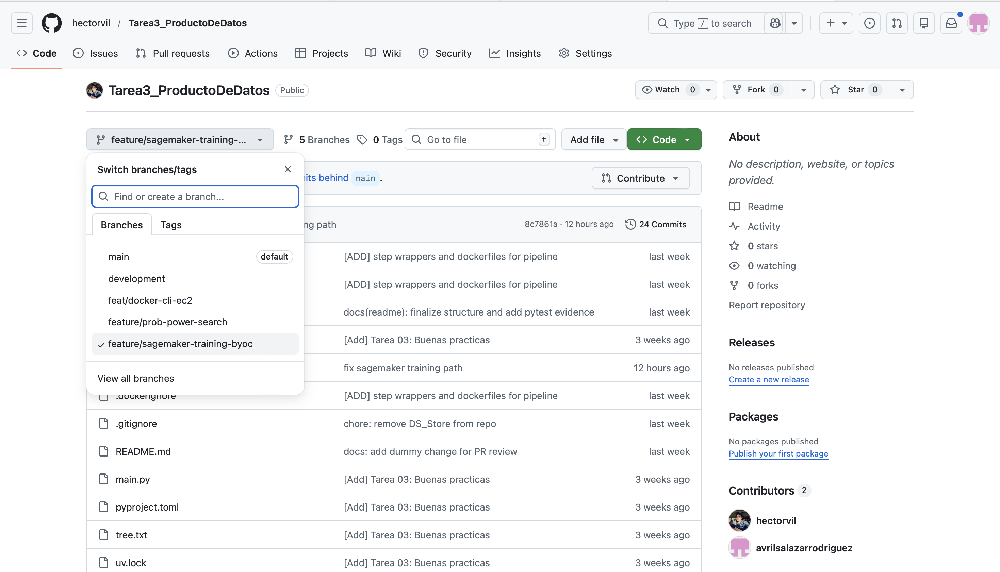
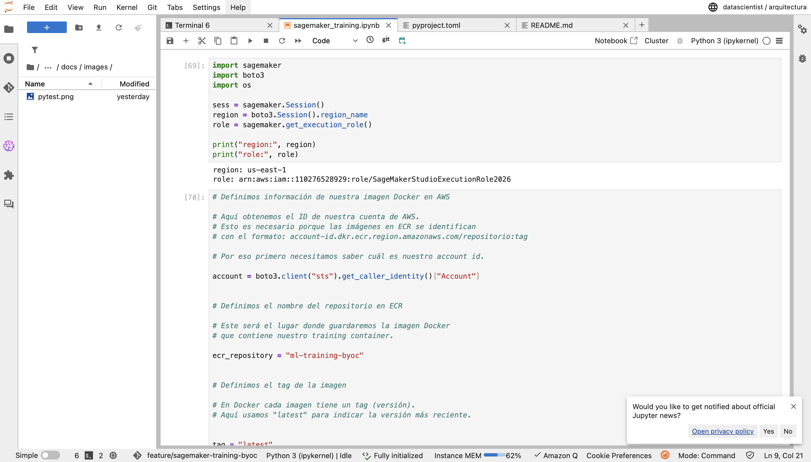
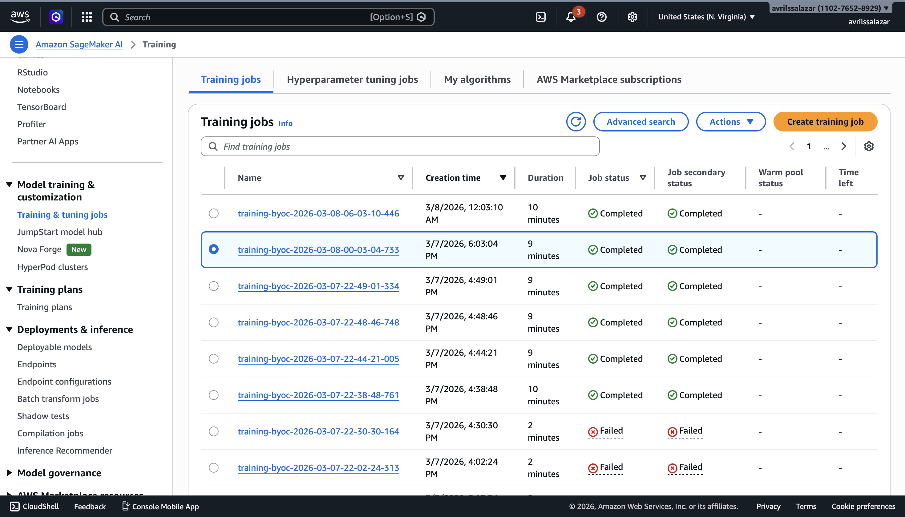
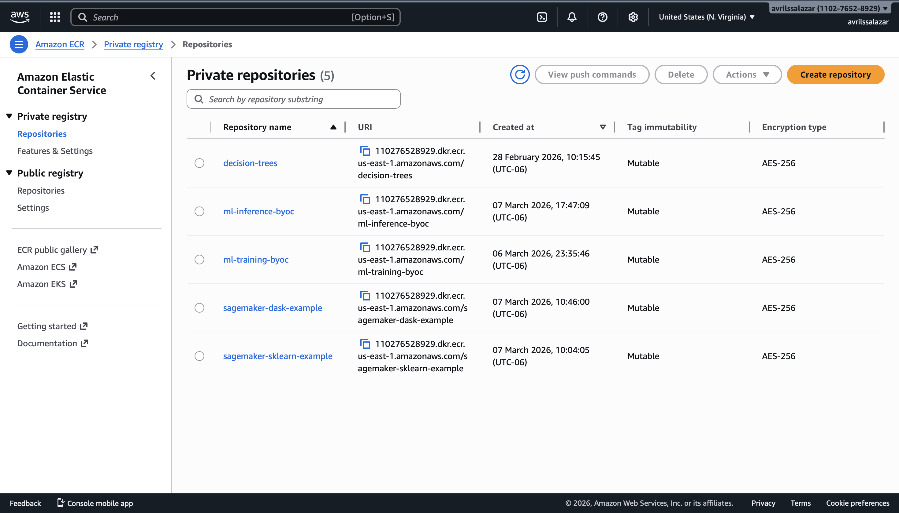
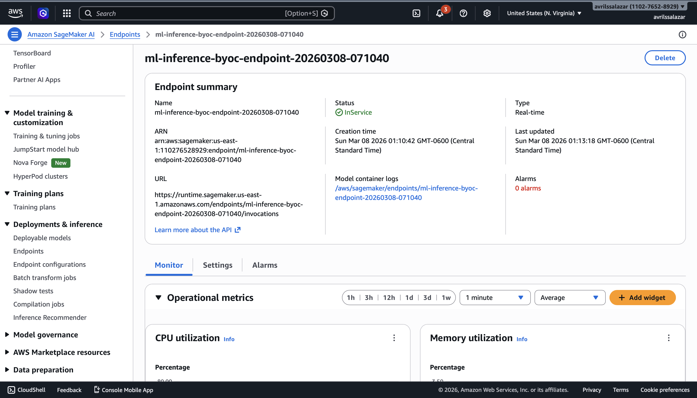
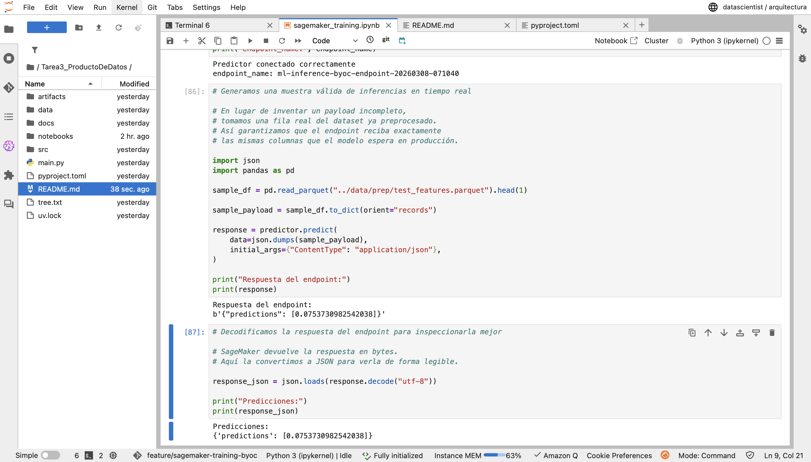

# Tarea 06 — SageMaker Processing BYOC

## Objetivo

En esta tarea se construyó un **SageMaker Processing Job** usando un **contenedor propio (BYOC)** para ejecutar el preprocesamiento de nuestros datos.

La idea fue separar el **preprocessing** del **training**. En lugar de transformar los datos en local, SageMaker toma los archivos crudos desde **S3**, ejecuta `preprocess.py` dentro del contenedor y guarda los archivos transformados nuevamente en **S3**.

---

## Flujo del procesamiento

```text
S3 (raw) -> /opt/ml/processing/input/raw -> preprocess.py -> /opt/ml/processing/output -> S3 (processed)
```

---
## Estructura agregada al repositorio
```text

processing/
├── container/
│   └── Dockerfile
└── preprocess.py

notebooks/
└── sm_processing_byoc.ipynb
```
---
## Estructura actualizada del repositorio

```text
.
├── artifacts
│   ├── logs
│   │   ├── inference_20260214_000519.log
│   │   ├── inference_20260301_122327.log
│   │   ├── prep_20260213_235935.log
│   │   ├── prep_20260301_122239.log
│   │   ├── train_20260214_000203.log
│   │   └── train_20260301_122252.log
│   └── model.joblib
├── data
│   ├── inference
│   │   └── test_features.parquet
│   ├── predictions
│   │   └── submission.csv
│   ├── prep
│   │   ├── meta.json
│   │   ├── test_features.parquet
│   │   ├── test_pairs.parquet
│   │   ├── train.parquet
│   │   └── valid.parquet
│   └── raw
│       ├── sales_train.csv
│       └── test.csv
├── docs
│   └── images
│       ├── github_pr_sagemaker_feature.png
│       ├── pytest.png
│       ├── sagemaker_ecr_repositories.png
│       ├── sagemaker_endpoint_inservice.png
│       ├── sagemaker_notebook_workflow.png
│       ├── sagemaker_realtime_inference.png
│       └── sagemaker_training_job_completed.png
├── import json.py
├── import os.jl
├── import os.py
├── main.py
├── notebooks
│   ├── Entendimientodelos_datosEDA.ipynb
│   ├── FeatureEngineering.ipynb
│   ├── Modeling.ipynb
│   ├── sagemaker_training.ipynb
│   ├── SimulationComparation.ipynb
│   └── sm_processing_byoc.ipynb
├── processing
│   ├── container
│   │   └── Dockerfile
│   └── preprocess.py
├── pyproject.toml
├── README.md
├── src
│   ├── __init__.py
│   ├── __pycache__
│   │   ├── __init__.cpython-312.pyc
│   │   └── config.cpython-312.pyc
│   ├── config.py
│   ├── inference
│   │   ├── __init__.py
│   │   ├── __main__.py
│   │   ├── __pycache__
│   │   ├── Dockerfile
│   │   ├── inference.py
│   │   └── test
│   ├── preprocessing
│   │   ├── __init__.py
│   │   ├── __main__.py
│   │   ├── __pycache__
│   │   ├── Dockerfile
│   │   ├── prep.py
│   │   └── test
│   ├── training
│   │   ├── __init__.py
│   │   ├── __main__.py
│   │   ├── __pycache__
│   │   ├── Dockerfile
│   │   ├── test
│   │   └── train.py
│   └── utils
│       ├── __init__.py
│       ├── __pycache__
│       ├── data_validation.py
│       ├── logging_utils.py
│       └── metrics.py
├── tmp
│   ├── model
│   │   └── model.joblib
│   └── output
├── tree.txt
└── uv.lock
```
## Archivos principales
- processing/container/Dockerfile

Define la imagen Docker usada por SageMaker Processing.
Incluye las librerías necesarias para correr el preprocesamiento.

- processing/preprocess.py

Contiene la lógica de transformación de mi dataset.
Lee los datos desde /opt/ml/processing/input/raw y guarda los resultados en /opt/ml/processing/output.

Los archivos generados son:

* train.csv

* valid.csv

* test_features.csv

* test_pairs.csv

- notebooks/sm_processing_byoc.ipynb

Contiene el flujo completo de la tarea:

1.- Setup de SageMaker

2.- Carga del dataset a S3

3.- Build y push de la imagen a ECR

4.- Ejecución del Processing Job

5.- Verificación del output en S3

6.- Inspección de las primeras filas del resultado
---
## Dependencias
Dependencias del contenedor

scikit-learn

pandas

numpy

Dependencias del notebook

boto3

sagemaker

---
## Qué hace el preprocessing

El script preprocess.py ajusta la lógica de preprocesamiento de nuestro proyecto para que pueda ejecutarse correctamente dentro de SageMaker Processing siguiente de forma general este flujo:

- Toma los archivos crudos del dataset

- Luego limpia y transforma los datos

- Después construye los conjuntos de entrenamiento, validación y prueba

- Y por último genera archivos CSV listos para usarse después en el pipeline
---
## Ejecución del Processing Job

El Processing Job se ejecuta con ScriptProcessor, usando una sola instancia de SageMaker.

La configuración se resume en los siguientes pasos:

- El input llegue desde S3 a /opt/ml/processing/input/raw

- luego el script corra con python3

- Donde los outputs se escriban en /opt/ml/processing/output

- Y SageMaker suba automáticamente esos resultados a S3

---
## Evidencias y screenshots de ejecuciones y de los outputs

### Imagen funcional en Amazon ECR


### Processing Job exitoso


### Output en S3


## Git Workflow

Se implementó una estrategia de branching profesional alineada con prácticas de MLOps.

### Ramas principales

- `main`: versión estable lista para producción
- `development`: rama de integración continua
- `feature/*`: ramas para cada entregable o mejora específica

### Flujo aplicado

1. Crear rama `feature/*` desde `development`
2. Implementar cambios de manera incremental
3. Realizar commits atómicos
4. Abrir Pull Request hacia `development`
5. Revisar y aprobar cambios
6. Merge a `development`
7. Pull Request final de `development` hacia `main`

### Rama utilizada en esta tarea

- `feature/sagemaker-training-byoc`

### Política aplicada

- No se realizaron commits directos a `main`
- No se realizaron commits directos a `development`
- Todo cambio pasó por una feature branch y un Pull Request



---

## Adaptación a SageMaker

Se adaptaron dos componentes principales del repositorio:

### Training container

El script `src/training/train.py` fue ajustado para que SageMaker pueda:

- leer los datos de entrenamiento desde el canal montado por SageMaker
- guardar el artefacto final del modelo en `/opt/ml/model`
- empaquetar automáticamente ese artefacto en `model.tar.gz` dentro de S3

La imagen utilizada para entrenamiento se construyó desde:

- `src/training/Dockerfile`

### Inference container

El script `src/inference/inference.py` fue adaptado para exponer los endpoints HTTP requeridos por SageMaker:

- `GET /ping`
- `POST /invocations`

La imagen utilizada para inferencia se construyó desde:

- `src/inference/Dockerfile`

Además, el contenedor de inferencia fue ajustado para arrancar con `gunicorn`, dejando instalado `flask` y `gunicorn` dentro del entorno del contenedor.

---

## Notebook de SageMaker

Se agregó un notebook específico para ejecutar el flujo solicitado en AWS SageMaker:

- `notebooks/sagemaker_training.ipynb`

En este notebook se documenta la ejecución completa de:

- creación o validación de repositorios en ECR
- referencia a imágenes Docker en AWS
- creación del Estimator
- upload de datos preprocesados a S3
- lanzamiento del training job
- creación del objeto Model
- despliegue del endpoint
- prueba de inferencia en tiempo real



---

## Detalle

### Notebooks

- **`notebooks/Entendimientodelos_datosEDA.ipynb`**  
  Exploración del dataset: nulos, rangos, outliers, devoluciones, agregación mensual, estacionalidad e intermitencia.

- **`notebooks/FeatureEngineering.ipynb`**  
  Construcción de features para series de tiempo y guardado de base intermedia en `data/prep/`.

- **`notebooks/Modeling.ipynb`**  
  Entrenamiento local del modelo y experimentación.

- **`notebooks/SimulationComparation.ipynb`**  
  Evaluación, análisis de resultados y comparación operativa.

- **`notebooks/sagemaker_training.ipynb`**  
  Ejecución del flujo en AWS SageMaker con contenedores BYOC para entrenamiento e inferencia en tiempo real.

### Scripts (pipeline automatizable)

Los scripts se ejecutan desde la raíz del repo y siguen la estructura antes mencionada:

- **`src/preprocessing/prep.py`**  
  - Entrada: `data/raw/`  
  - Salida: `data/prep/`

- **`src/training/train.py`**  
  - Entrada local: `data/prep/`  
  - Entrada en SageMaker: `/opt/ml/input/data/train/`  
  - Salida local: `artifacts/model.joblib`  
  - Salida en SageMaker: `/opt/ml/model/model.joblib`

- **`src/inference/inference.py`**  
  - Entrada en SageMaker: `/opt/ml/model/model.joblib`  
  - Salida: predicciones vía endpoint HTTP en tiempo real

---

## Entrenamiento en SageMaker

El entrenamiento se ejecutó como un **training job administrado por SageMaker**.

Se utilizó:

- instancia `ml.m5.large`
- imagen Docker personalizada en ECR
- artefacto final almacenado automáticamente en S3

Resultado del entrenamiento:

- **Training job completado correctamente**
- **Training time:** 525 segundos
- **Billable time:** 525 segundos



---

## Imágenes Docker en Amazon ECR

Se construyeron y publicaron dos imágenes principales en **Amazon ECR**:

- `ml-training-byoc`
- `ml-inference-byoc`

Estas imágenes contienen toda la lógica necesaria para que SageMaker ejecute el entrenamiento y el serving del modelo usando contenedores personalizados.



---

## Endpoint en tiempo real

Se levantó un endpoint de inferencia en tiempo real en SageMaker usando el contenedor de serving y el artefacto del modelo generado por el training job.

Endpoint creado:

- `ml-inference-byoc-endpoint-20260308-071040`

Estado final:

- **InService**

Esto confirma que:

- el contenedor pasó el `ping health check`
- SageMaker pudo descargar la imagen desde ECR
- SageMaker pudo descargar el modelo desde S3
- el servicio quedó listo para recibir inferencias



---

## Inferencias en tiempo real

Se probó el endpoint enviando una muestra válida de inferencia en tiempo real.

Para evitar errores por columnas faltantes, la muestra no se construyó manualmente, sino que se tomó directamente de una fila real del dataset preprocesado:

- `data/prep/test_features.parquet`

Esto garantiza que el payload enviado al endpoint contiene exactamente las columnas esperadas por el modelo.

Resultado de la inferencia:

```python
Predicciones:
{'predictions': [0.0753730982542038]}
```


---

Este resultado confirma que el endpoint:

- recibe correctamente el request
- transforma el payload
- carga el modelo
- ejecuta la inferencia
- devuelve una respuesta válida en JSON

---

## Dockerfiles utilizados

### Training

El contenedor de training se construyó desde:

- `src/training/Dockerfile`

Su propósito es instalar dependencias, copiar el código fuente y ejecutar el script de entrenamiento bajo el contrato esperado por SageMaker.

### Inference

El contenedor de inferencia se construyó desde:

- `src/inference/Dockerfile`

Su propósito es instalar dependencias, exponer la aplicación Flask vía gunicorn y servir las rutas `/ping` e `/invocations` requeridas por SageMaker.

---

## Dependencias principales

- `pandas`
- `numpy`
- `lightgbm`
- `scikit-learn`
- `joblib`
- `pyarrow`
- `flask`
- `gunicorn`
- `sagemaker`
- `boto3`
- `pytest`

---

## Instalación y Setup

### Clonar el repositorio

```bash
git clone <repo_url>
cd Tarea3_ProductoDeDatos
```

---

## Instalación y Setup

### Instalar dependencias con uv

```bash
uv sync
```

### O manualmente

```bash
pip install pandas numpy lightgbm scikit-learn joblib pyarrow flask gunicorn sagemaker boto3 pytest
```

---

## Cómo ejecutar el flujo en SageMaker

### Construir imagen de training

```bash
docker build --network sagemaker -t ml-training-byoc -f src/training/Dockerfile .
```

### Publicar imagen de training en ECR

```bash
docker tag ml-training-byoc:latest <account>.dkr.ecr.<region>.amazonaws.com/ml-training-byoc:latest
docker push <account>.dkr.ecr.<region>.amazonaws.com/ml-training-byoc:latest
```

### Construir imagen de inference

```bash
docker build --no-cache --network sagemaker -t ml-inference-byoc:v2 -f src/inference/Dockerfile .
```

### Publicar imagen de inference en ECR

```bash
docker tag ml-inference-byoc:v2 <account>.dkr.ecr.<region>.amazonaws.com/ml-inference-byoc:v2
docker push <account>.dkr.ecr.<region>.amazonaws.com/ml-inference-byoc:v2
```

### Entrenar en SageMaker

Desde `notebooks/sagemaker_training.ipynb`, usando `Estimator.fit(...)`.

### Desplegar endpoint

Desde `notebooks/sagemaker_training.ipynb`, usando `Model.deploy(...)`.

### Probar inferencia en tiempo real

Desde el mismo notebook, enviando un payload válido con `predictor.predict(...)`.

---

## Outputs esperados

### Durante training

Artifact del modelo en S3:

```text
s3://.../output/model.tar.gz
```

### Durante serving

- endpoint activo en SageMaker
- respuesta JSON de inferencia en tiempo real

---

## README y documentación

Este README documenta la adaptación del proyecto a AWS SageMaker manteniendo la estructura profesional del repositorio y evidenciando:

- uso de Git workflow
- imágenes Docker funcionales
- ejecución en SageMaker
- despliegue de endpoint real-time
- inferencias válidas en producción administrada

---

## Referencias

- SageMaker Python SDK Documentation
- AWS SageMaker Developer Guide
- AWS ECR Documentation
- Kaggle: Predict Future Sales
