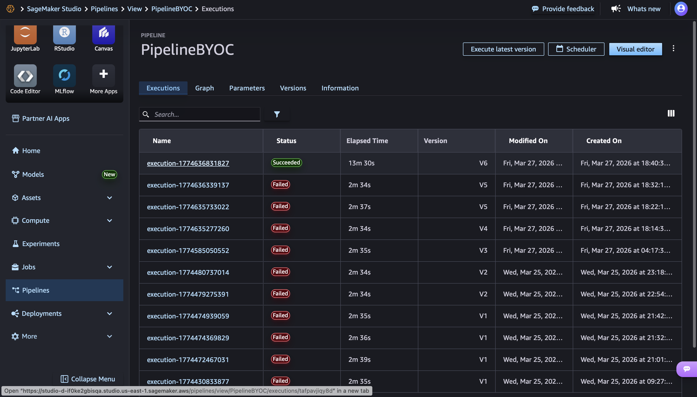
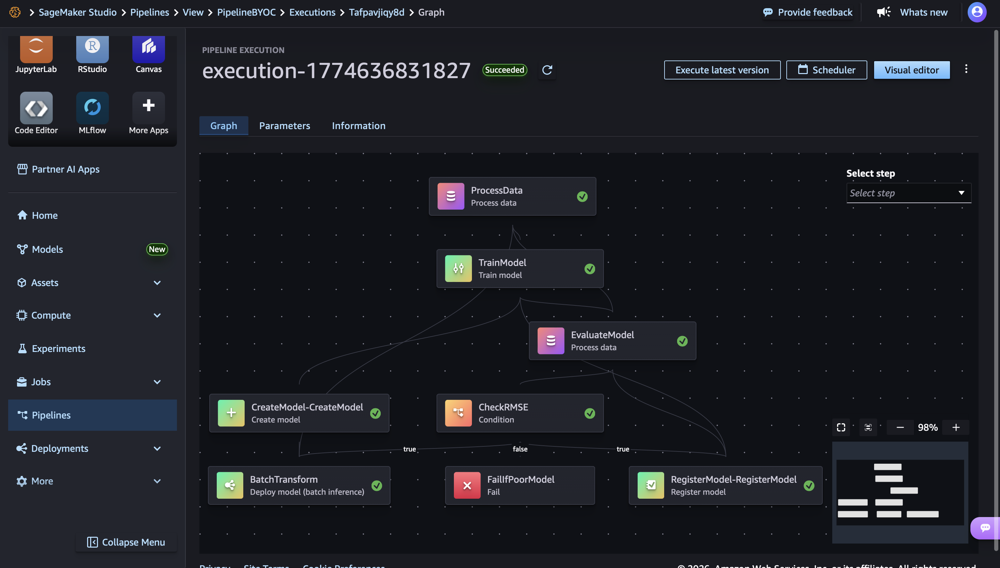
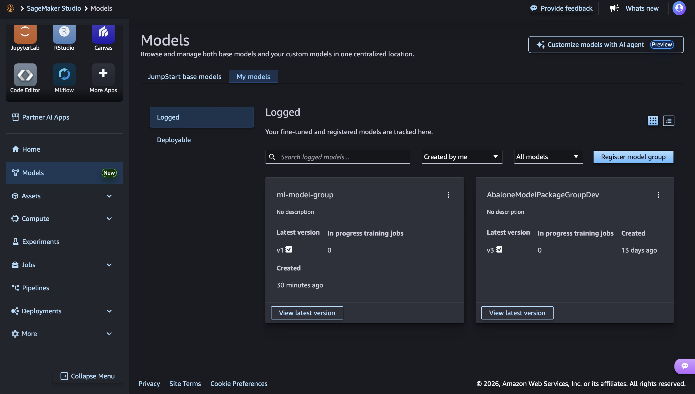
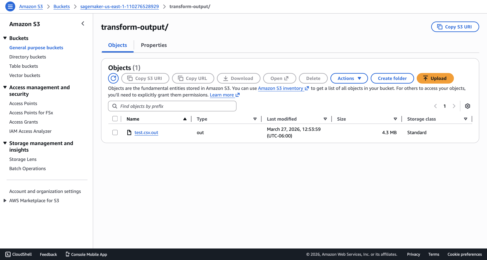
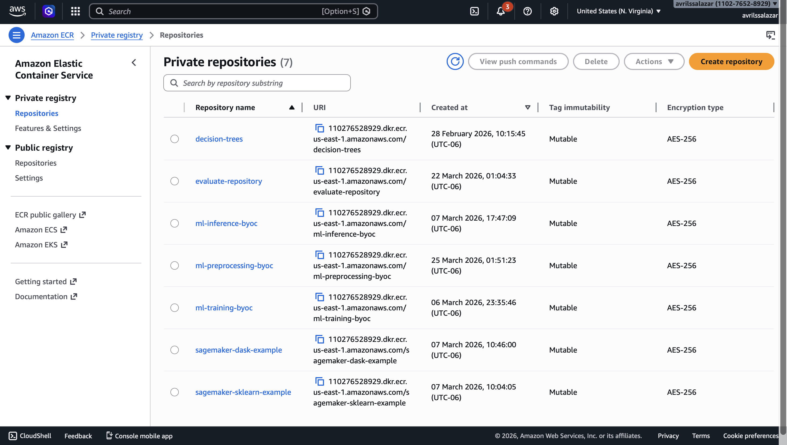

# Tarea 07: SageMaker Pipelines — BYOC End-to-End

## Objetivo

En esta tarea se integran contenedores BYOC de preprocessing, training e inference en un pipeline completo de Amazon SageMaker Pipelines. El flujo final reutiliza los componentes desarrollados en tareas anteriores y los conecta en un proceso end-to-end para:

- procesar datos
- entrenar el modelo
- evaluar el modelo con RMSE
- crear el modelo de inferencia
- ejecutar batch transform
- registrar el modelo en el Model Registry si cumple el umbral de calidad

El resultado final es un pipeline reproducible, parametrizable y ejecutado en SageMaker Studio.

---

## Branch de trabajo

La implementación de esta tarea se desarrolló en la branch:

`feature/sagemaker-pipeline-byoc`

Esta branch fue creada a partir de `development`, después de integrar los PRs de training y preprocessing requeridos por la consigna.

---

## Notebook principal

El notebook principal de esta entrega es:

`notebooks/sagemaker_pipeline_byoc.ipynb`

En este notebook se definieron, probaron y ejecutaron todos los steps del pipeline BYOC.

---

## Resumen del pipeline

El pipeline final quedó compuesto por los siguientes steps:

1. **ProcessData**  
   Usa el contenedor BYOC de preprocessing para leer los datos raw desde S3, generar `train`, `validation` y `test`, y escribir los outputs en las rutas esperadas por SageMaker.

2. **TrainModel**  
   Usa el contenedor BYOC de training para entrenar el modelo con los canales `train` y `validation`, y guardar el artefacto del modelo en `/opt/ml/model`.

3. **EvaluateModel**  
   Reutiliza el contenedor de preprocessing con el script `evaluate.py` para cargar el modelo entrenado, evaluar sobre validation y escribir `evaluation.json` con la métrica RMSE.

4. **CreateModel**  
   Crea el modelo de inferencia utilizando la imagen BYOC de serving.

5. **CheckRMSE**  
   Evalúa la métrica registrada en `evaluation.json` y la compara contra el parámetro `rmse_threshold`.

6. **BatchTransform**  
   Si el RMSE cumple el umbral, ejecuta batch inference sobre los datos de test y escribe el output en S3.

7. **RegisterModel**  
   Si el RMSE cumple el umbral, registra el modelo en el Model Registry bajo el grupo `ml-model-group`.

8. **FailIfPoorModel**  
   Si el modelo no cumple el umbral definido, el pipeline termina en estado fallido.

---

## Imágenes BYOC utilizadas

Durante esta tarea se utilizaron las siguientes imágenes en Amazon ECR:

- `ml-preprocessing-byoc`
- `ml-training-byoc`
- `ml-inference-byoc`

El step de evaluación reutiliza el contenedor de preprocessing junto con el script `src/evaluation/evaluate.py`.

---

## Resultado final

La ejecución final del pipeline terminó con estado **Succeeded** en SageMaker Pipelines.

Además, se verificó correctamente que:

- el modelo fue registrado en el **Model Registry**
- el output de **Batch Transform** fue escrito en **S3**
- las imágenes BYOC quedaron disponibles en **Amazon ECR**

---

## Evidencias

### Pipeline ejecutado exitosamente





### Model Registry



### Batch Transform output en S3



### Repositorios en ECR



---

## Estructura del repositorio

```text
.
├── artifacts
│   ├── logs
│   └── model.joblib
├── data
│   ├── predictions
│   ├── prep
│   └── raw
├── docs
│   └── images
│       ├── batch_transform_s3.png
│       ├── ecr_repositories.png
│       ├── model_registry.png
│       ├── pipeline_succeeded.png
│       └── pipeline_succeeded_graph.png
├── notebooks
│   ├── Entendimientodelos_datosEDA.ipynb
│   ├── FeatureEngineering.ipynb
│   ├── Modeling.ipynb
│   ├── SimulationComparation.ipynb
│   ├── sagemaker_pipeline_byoc.ipynb
│   └── sagemaker_training.ipynb
├── src
│   ├── evaluation
│   │   └── evaluate.py
│   ├── inference
│   │   ├── Dockerfile
│   │   ├── __init__.py
│   │   ├── __main__.py
│   │   ├── inference.py
│   │   └── test
│   │       └── test_inference.py
│   ├── preprocessing
│   │   ├── Dockerfile
│   │   ├── __init__.py
│   │   ├── __main__.py
│   │   ├── prep.py
│   │   └── test
│   │       └── test_prep.py
│   ├── training
│   │   ├── Dockerfile
│   │   ├── __init__.py
│   │   ├── __main__.py
│   │   ├── train.py
│   │   └── test
│   │       └── test_train.py
│   ├── config.py
│   └── utils
│       ├── data_validation.py
│       ├── logging_utils.py
│       └── metrics.py
├── pyproject.toml
├── README.md
└── uv.lock
```

En esta entrega, cada step del pipeline conserva su organización modular en src/, y se integró además el script de evaluación para medir RMSE dentro del flujo de SageMaker Pipelines.

---

## Implementación realizada

Durante esta entrega se adaptaron y conectaron los componentes BYOC del proyecto para ejecutar un pipeline completo en SageMaker Pipelines. Esto incluyó ajustes en preprocessing, training, evaluation e inference para que cada step pudiera intercambiar artefactos en el formato esperado por SageMaker y ejecutarse correctamente dentro del flujo end-to-end.

También se corrigieron los puntos necesarios para que la evaluación utilizara la métrica RMSE en el formato esperado por `ConditionStep`, para que Batch Transform procesara correctamente el output de test, y para que el modelo pudiera registrarse en SageMaker Model Registry cuando cumpliera el umbral definido.

---

## Verificación final

La versión final del pipeline fue ejecutada exitosamente en SageMaker Studio y completó de forma correcta el flujo completo de procesamiento, entrenamiento, evaluación, creación de modelo, inferencia batch y registro del modelo.

---

## Pull Request final

Como cierre de la entrega, los cambios de esta branch se integrarán mediante un Pull Request desde:

`feature/sagemaker-pipeline-byoc` → `development`

..

